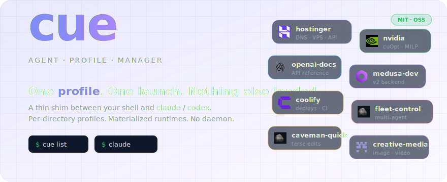
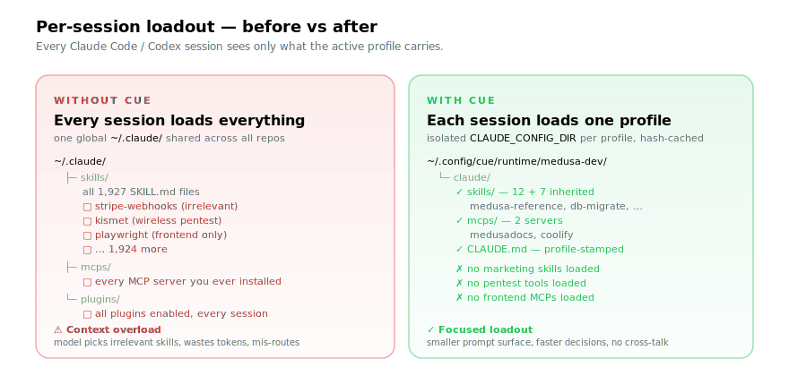
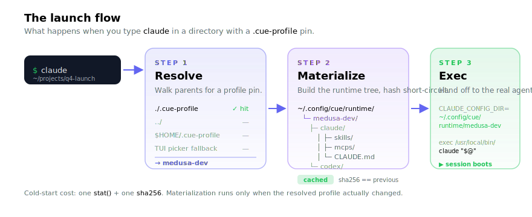
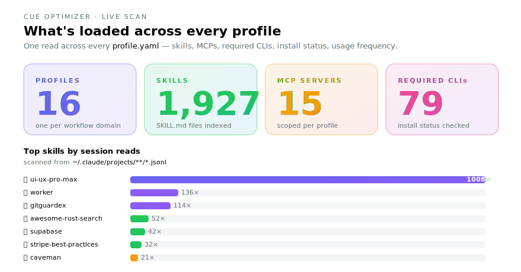
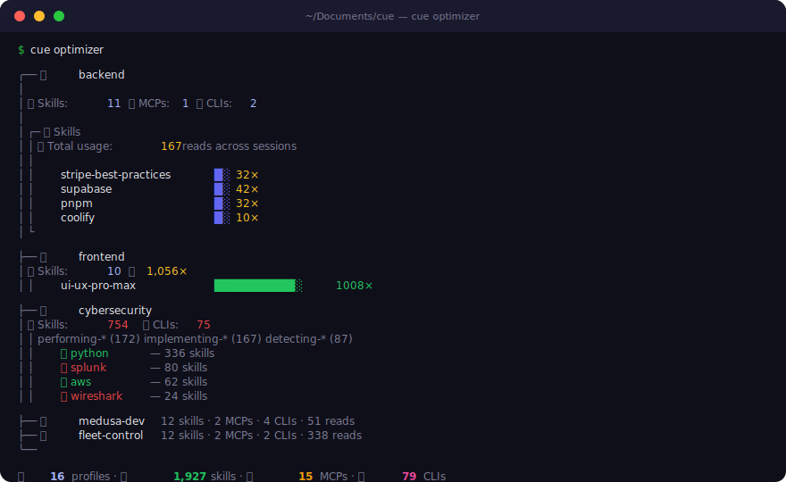
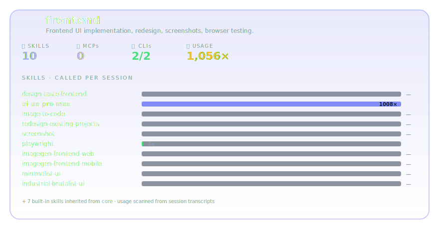
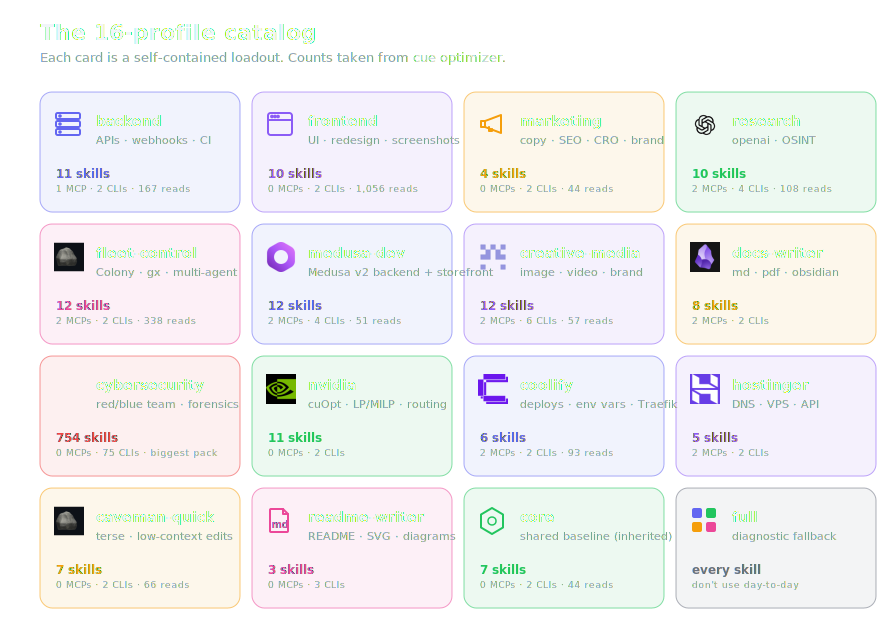

<p align="center">
  
</p>

# cue — Agent Profile Manager for Claude Code & Codex

> Pick a profile. Launch with the right skills, MCPs, and plugins. Nothing else.

`cue` is a CLI that sits between your shell and the agent binary. Type `claude` or `codex` and `cue` intercepts: it resolves which profile applies in the current directory, materializes an isolated `CLAUDE_CONFIG_DIR` (or `CODEX_HOME`) with just that profile's skills, MCP servers, and Claude Code plugins, then exec's the real agent. Per-directory pins mean the right loadout follows the project, not the terminal session.

---

## Why a profile manager at all?

<p align="center">
  
</p>

- **Per-profile isolation.** Skills, MCP servers, and Claude Code plugins are scoped to the active profile. Marketing work doesn't see frontend's MCPs; backend doesn't see design's skills. No more "every session has every tool" overload.
- **Directory-aware.** Pin a profile to a directory (`.cue-profile`), and every `claude` / `codex` you launch from inside boots with that loadout automatically. No flag wrangling.
- **Composable.** Profiles inherit from a `core` baseline so cross-session memory (claude-mem) and meta skills are shared by default. Add team-wide tools in one place.
- **Pre-launch picker.** First time you type `claude` in a fresh directory, a TUI picker opens. Pin or one-shot — your choice.
- **Materialized, hash-short-circuited.** Each launch rebuilds the runtime only when the resolved profile actually changed. Cold-start cost is a `stat()` + sha256 compare.
- **No service to run.** No daemon, no background process, no auto-update. Just a Bun CLI and a shim script in `~/.local/bin`.

---

## How it works

<p align="center">
  
</p>

Typing `claude` or `codex` in a repo where cue's shims are installed triggers a three-step launch flow:

1. **Resolve** — cue checks for a `.cue-profile` file in the current directory (or any parent up to `$HOME`). If none is found, it falls back to a repo-level default, a global default, or opens the TUI picker.
2. **Materialize** — cue builds `~/.config/cue/runtime/<profile>/{claude,codex}/` with a content-addressed hash check. If the profile hasn't changed, this is a no-op.
3. **Exec** — the real `claude` or `codex` binary is launched with `CLAUDE_CONFIG_DIR` (or `CODEX_HOME`) pointing at the materialized runtime tree.

Full resolve-precedence rules and bypass paths: **[docs/launch.md](./docs/launch.md)**.

---

## `cue optimizer` — see every loadout at a glance

Run it once and you get a dashboard of every profile: skills (with per-session usage), MCP servers, required CLIs (with install status ✅/❌), GitHub sources, and brand icons.

<p align="center">
  
</p>

What the optimizer scans for you:

- Every `profile.yaml` (inheritance resolved, `*` wildcards expanded)
- Each skill's frontmatter for `allowed-tools` and `## Prerequisites` → required CLIs
- `which <cli>` for every CLI → install status per profile
- `~/.claude/projects/**/*.jsonl` → per-skill usage counts across all sessions
- `~/skills-lock.json` → which GitHub repo each skill came from

### Terminal output

<p align="center">
  
</p>

```bash
cue optimizer                 # all profiles
cue optimizer backend         # just one
cue optimizer --expand        # expand grouped skills (useful for cybersecurity's 754)
```

### A single profile, expanded

<p align="center">
  
</p>

Each card shows what's actually loaded *plus* how often you've reached for each skill. The bar chart is computed from your local session transcripts — no telemetry leaves the machine.

---

## The 16-profile catalog

<p align="center">
  
</p>

```bash
cue list                      # show all
cue use medusa-dev            # pin to current directory
cd profiles/medusa-dev/workspace && claude
```

Each profile carries an emoji icon shown in the picker. Pick or change an icon with `cue icon <profile>` (interactive emoji picker). The active profile is also stamped at the top of the materialized `CLAUDE.md`, so `/goal` inside Claude Code shows which profile is loaded.

---

## Install (one line)

```bash
npm install -g cue-ai
```

Or via the install script:

```bash
curl -fsSL https://raw.githubusercontent.com/recodeee/cue/main/get.sh | bash
```

This installs bun (if needed), clones the repo to `~/Documents/cue`, and runs the interactive installer.

**Options:**

```bash
# Non-interactive (auto-yes)
curl -fsSL https://raw.githubusercontent.com/recodeee/cue/main/get.sh | bash -s -- --yes

# Custom install location
CUE_DIR=~/dev/cue curl -fsSL https://raw.githubusercontent.com/recodeee/cue/main/get.sh | bash
```

**Or clone manually:**

```bash
git clone https://github.com/recodeee/cue.git ~/Documents/cue && ~/Documents/cue/install.sh
```

`install.sh` is interactive: it installs the `claude` shim by default and asks before touching `codex` (in case you already have a wrapper there). Non-interactive variants:

```bash
~/Documents/cue/install.sh --yes           # install claude shim, skip codex prompt
~/Documents/cue/install.sh --yes --codex   # install both shims (clobbers existing codex on PATH)
~/Documents/cue/install.sh --uninstall     # remove the symlinks, leave the repo
```

### What the installer does

1. Verifies `git` and `bun` (Bun ≥ 1.0; install from https://bun.sh)
2. Runs `bun install` inside the repo
3. Self-checks `bin/cue --version`
4. Symlinks `~/.local/bin/cue` → `<repo>/bin/cue`
5. Checks that `~/.local/bin` is on your `$PATH` (warns if not)
6. Writes the `~/.local/bin/claude` shim (and optionally `codex`)

Idempotent. Safe to re-run on any machine that already has cue installed.

### After install

```bash
cd ~/projects/q4-launch-campaign
echo marketing > .cue-profile
claude          # boots with the marketing profile's skills, MCPs, and plugins
```

See [docs/launch.md](./docs/launch.md) for the resolve → materialize → exec flow.

---

## Quick install — pick your OS (legacy soul flow)

Two paths per OS:

- **Direct** — copy a shell block, paste in a terminal, runs the install end-to-end.
- **Agent-driven** — paste the corresponding `setup/<os>.md` into Claude Code as your first message; it walks you through the phases interactively (recommended if you've never set this up).

The shell blocks below trigger GitHub's "copy" button when you hover over them on github.com — one click to clipboard.

### macOS

Open **Terminal** (⌘+Space → "Terminal"), paste, run once:

```bash
# 1. Homebrew
[ -x "$(command -v brew)" ] || /bin/bash -c "$(curl -fsSL https://raw.githubusercontent.com/Homebrew/install/HEAD/install.sh)"
# 2. Core tools
brew install bun node@22 python@3.12 uv jq rtk
# 3. Claude Code
curl -fsSL https://claude.ai/install.sh | sh
# 4. RTK token-savings hook
rtk init -g
echo "Setup complete. Run:  claude  — then paste setup/macos.md as your first message."
```

→ Full agent-driven prompt: **[setup/macos.md](./setup/macos.md)** (paste into Claude Code)

### Linux (Ubuntu / Debian / Fedora / Arch)

```bash
# 1. System packages
if   command -v apt    >/dev/null; then sudo apt update && sudo apt install -y curl git jq build-essential python3 python3-pip
elif command -v dnf    >/dev/null; then sudo dnf install -y curl git jq @development-tools python3 python3-pip
elif command -v pacman >/dev/null; then sudo pacman -S --noconfirm curl git jq base-devel python python-pip
fi
# 2. Bun
[ -x "$(command -v bun)" ] || curl -fsSL https://bun.sh/install | bash
export PATH="$HOME/.bun/bin:$HOME/.local/bin:$PATH"
# 3. uv (Python venv manager)
[ -x "$(command -v uv)" ] || curl -LsSf https://astral.sh/uv/install.sh | sh
# 4. RTK
[ -x "$(command -v rtk)" ] || (curl -fsSL https://github.com/rtk-ai/rtk/releases/latest/download/rtk-x86_64-unknown-linux-gnu.tar.gz | tar xz -C /tmp && sudo install /tmp/rtk /usr/local/bin/rtk)
# 5. Claude Code
curl -fsSL https://claude.ai/install.sh | sh
rtk init -g
echo "Setup complete. Run:  claude  — then paste setup/linux.md as your first message."
```

→ Full agent-driven prompt: **[setup/linux.md](./setup/linux.md)**

### Windows 10 / 11 (PowerShell)

Open **PowerShell**. First-time only:

```powershell
Set-ExecutionPolicy -Scope CurrentUser -ExecutionPolicy RemoteSigned
```

Then:

```powershell
# 1. Core tools via winget
winget install --id OpenJS.NodeJS.LTS  --silent --accept-source-agreements --accept-package-agreements
winget install --id Python.Python.3.12 --silent --accept-source-agreements --accept-package-agreements
winget install --id stedolan.jq        --silent --accept-source-agreements --accept-package-agreements
winget install --id Git.Git            --silent --accept-source-agreements --accept-package-agreements
$env:Path = [System.Environment]::GetEnvironmentVariable("Path","Machine") + ";" + [System.Environment]::GetEnvironmentVariable("Path","User")
# 2. Bun + uv
if (-not (Get-Command bun -ErrorAction SilentlyContinue)) { irm bun.sh/install.ps1 | iex }
if (-not (Get-Command uv  -ErrorAction SilentlyContinue)) { irm https://astral.sh/uv/install.ps1 | iex }
# 3. Claude Code via npm
npm install -g @anthropic-ai/claude-code
# 4. RTK
if (-not (Get-Command rtk -ErrorAction SilentlyContinue)) {
    Invoke-WebRequest -Uri "https://github.com/rtk-ai/rtk/releases/latest/download/rtk-x86_64-pc-windows-msvc.zip" -OutFile "$env:TEMP\rtk.zip"
    Expand-Archive -Path "$env:TEMP\rtk.zip" -DestinationPath "$env:USERPROFILE\.local\bin" -Force
}
rtk init -g
Write-Host "Setup complete. Run:  claude  — then paste setup/windows.md as your first message."
```

→ Full agent-driven prompt: **[setup/windows.md](./setup/windows.md)**

(WSL2 user? Use the Linux block inside your WSL distro instead — cleaner.)

---

## Optional — Parallel agents tier (Colony + gitguardex)

If you want to run **2+ Codex/Claude agents in parallel on the same repo** without them stomping on each other, layer this tier on top of the lean stack:

- **[recodeee/gitguardex](https://github.com/recodeee/gitguardex)** — `gx` CLI. Per-agent branch + worktree isolation, file locks, PR-only merges.
- **[recodeee/colony](https://github.com/recodeee/colony)** — Local-first MCP for fleet coordination. Replaces 30k-token repo handoffs with ~400-token compact state in SQLite at `~/.colony`. Auto-detects file claims, task graphs, and prior decisions so agents see ownership before editing.

→ Full setup prompt: **[setup/parallel-agents.md](./setup/parallel-agents.md)** (Linux + macOS; Windows via WSL2)

Skip this tier if you only ever run one Claude Code window at a time — claude-mem + gbrain are enough for solo work.

---

## Profiles

Profiles keep each Claude Code or Codex session lean by materializing only the skills and MCPs needed for the current job.

### Saving the current session as a profile

From any Claude Code session, ask: *"save this as a profile"*. The
`meta/save-profile` skill walks you through the steps and calls
`cue create-profile` to write the YAML:

```bash
cue create-profile my-project \
  --icon "🦊" \
  --description "My project work" \
  --skills design/ui-ux-pro-max,research/find-skills \
  --pin
```

### Multi-account flow (with authmux)

If you keep separate Claude/Codex accounts (e.g. via `authmux`), point each
alias at its own `CLAUDE_CONFIG_DIR`:

```bash
alias claude-account2="CLAUDE_CONFIG_DIR=$HOME/.claude-accounts/account2 cue launch claude"
```

cue detects the pre-set config dir, copies `.credentials.json` and merges the
account's `settings.json` into the materialized runtime, and **always shows
the picker** with the previously-pinned profile on top — so you can pick a
different profile per session without losing the auth.

Start with the docs hub at **[docs/profiles/](./docs/profiles/)** for the schema, inheritance model, scan-to-profile flow, and troubleshooting.

---

## For AI agents

If you are an AI coding agent helping a human set this up, read **[AGENTS.md](./AGENTS.md)** first — it explains the bootstrap contract (phase-by-phase, ask-before-network, verify-each-step) and points to the per-OS prompt your user should paste.

---

## What you get

After bootstrap (~550 MB cold RAM per session):

| Layer | What it does |
|---|---|
| **claude-mem** plugin | Captures session observations passively; `mem-search "topic"` to recall across sessions |
| **caveman** plugin | `/caveman` for terse replies, `/caveman-commit` for Conventional Commit messages |
| **RTK** (CLI hook) | Filters shell-command outputs — 60-90% token savings on `ls` / `git` / `cat` |
| **gbrain** MCP | Personal knowledge wiki with embeddings, backlinks, timeline |
| **excel-mcp-server** | Native `.xlsx` read/write/format |
| **office-word-mcp-server** | Native `.docx` read/write |

claude-mem (passive) and gbrain (manual wiki) are complementary — both recommended.

---

## Repo layout

- `profiles/` — one directory per profile; a YAML decides what loads. Inheritance chains depth-3, agents=[claude-code|codex] scoping per resource.
- `resources/skills/` — local skill library composed into profiles. Source for the `skills/local:` field.
- `resources/mcps/` — MCP server configs (`claude.sanitized.json`, `codex.sanitized.json`) composed into profiles.
- `plugins/cue/` — the Claude Code plugin shipping `/cue`, `/cue switch`, `/cue reload`, `/cue current` slash commands.
- `src/` — the Bun CLI itself: `commands/` (including `optimizer.ts`), `lib/{cwd-resolver,picker,runtime-materializer,…}`.
- `setup/` — per-OS install prompts you can paste into an agent session.
- `docs/` — `launch.md` (hot-path flow), `shell-install.md` (shim install + PATH), `assets/` (the SVGs in this README), `superpowers/specs/` (design + plans).

```
cue/
├── skills/         110+ Claude Code / Codex skills
│   ├── medusa/     building-with-medusa, storefront-best-practices, …
│   ├── codex-fleet/  bringup, dispatch, supervisors, panes, troubleshoot
│   ├── higgsfield/   generate, marketplace-cards, soul-id
│   ├── caveman/      caveman, caveman-commit, caveman-compress
│   └── ...
├── mcps/           MCP server snapshots + configs
│   ├── configs/    claude.sanitized.json, codex.sanitized.json, …
│   ├── mcps/       individual MCP server entries
│   └── plugins/    Claude Code plugin snapshots
└── setup/          paste-into-Claude-Code prompts (macos.md, linux.md, windows.md)
```

License: [MIT](./LICENSE).

---

## Contributing

Each skill is a folder with `SKILL.md` (frontmatter + body) plus reference files. The frontmatter `description` is what the LLM matches against — write it as `"when user says X, do Y"`.

To add a new skill: copy an existing one as a template, edit `SKILL.md`, drop it under `skills/skills/<category>/<slug>/`. The catalog regenerates on the next sync.

Want to redesign the SVGs in this README? They live in [`docs/assets/`](./docs/assets/) — edit the XML directly or regenerate with the `readme-writer` cue profile (`echo readme-writer > .cue-profile`).
